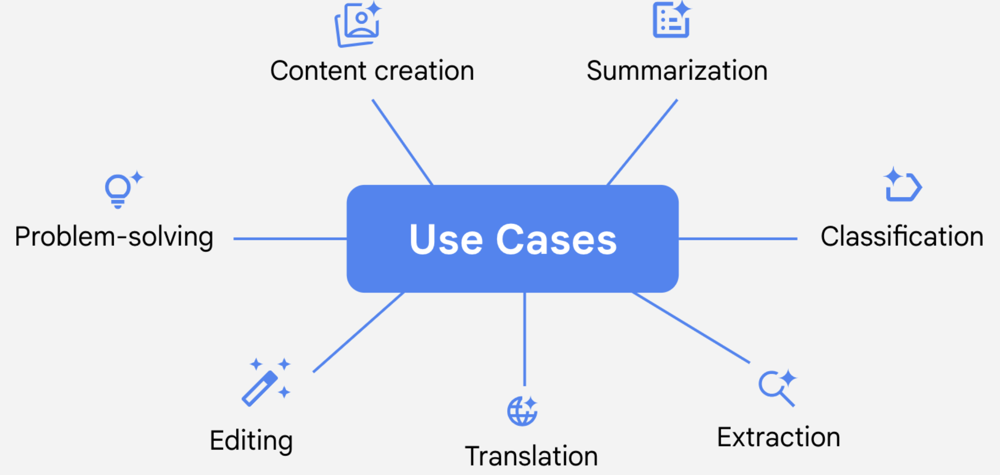

# Escribe instrucciones claras y específicas
es cierto que la calidad de lo que se empieza ​afecta en gran medida a la calidad de lo que produce.

la calidad de la instrucción ​que se pone en una herramienta de IA conversacional puede afectar ​la calidad de los resultados de la herramienta. 

La ingeniería de instrucciones implica diseñar ​la mejor instrucción que puedas para obtener el resultado deseado ​de un LLM. Esto incluye escribir instrucciones claras y específicas ​que proporcionen un contexto relevante. 

para obtener la información necesaria de un LLM , ​la instrucción debe ser más específica.
Cuando proporcionas instrucciones claras y específicas que incluyen el contexto, permites que los LLM ​generar resultados útiles.

Ten en cuenta que debido a las limitaciones del LLM , ​puede haber algunos casos ​en los que no se pueda obtener un resultado de calidad ​independientemente de la calidad de tu instrucción. 

si le pides al LLM ​que busque información sobre un acontecimiento de actualidad , ​pero el LLM no tiene acceso a esa información , ​no será capaz de proporcionar el resultado que necesitas.

A veces, incluso cuando se proporcionan ​instrucciones claras y específicas, puede que no obtengas el resultado en el primer intento. 

# Buenas prácticas para dar instrucciones
Las instrucciones son una habilidad esencial para sacar el máximo partido de la IA generativa. Para obtener los mejores resultados de una herramienta de IA, hay que elaborar una buena instrucción. 

marco sencillo: Tarea, Contexto, Referencias, Evaluar e Iterar.

### Especifique la tarea
El primer paso para crear un buen aviso es establecer claramente la tarea, es decir, lo que quieres que haga una herramienta de IA.  Sea detallado y evite la ambigüedad, que puede dar lugar a resultados incorrectos o irrelevantes.

¿De qué conocimientos quiere que se sirva la herramienta de IA y a quién va dirigida?
¿Cómo quiere que se formatee el resultado? 

#### Ejemplo
Tarea: Crear una publicación en las redes sociales sobre un próximo festival de música que se dirija a la comunidad musical local y, al mismo tiempo, atraiga a asistentes de otros estados.

Persona: Eres un promotor de conciertos especializado en aumentar la venta de entradas en el sector de la música rock alternativa.

Formato: Limita el mensaje a 125 caracteres. Incluye 5 hashtags relevantes.

### Proporcione el contexto necesario
Incluir un contexto detallado en sus mensajes puede limitar el enfoque de una herramienta de IA y adaptar su resultado. 

La información contextual de las instrucciones puede incluir:

- Razones y objetivos para realizar la tarea
- Reglas o directrices que debe seguir el resultado
- Información de fondo relevante que la herramienta debe tener en cuenta

#### Ejemplo que proporciona contexto:

Usted es un promotor de conciertos especializado en aumentar la venta de entradas en el sector de la música rock alternativa. Cree una publicación en las redes sociales sobre un próximo festival de música que se dirija a la comunidad musical local y, al mismo tiempo, atraiga a asistentes de otros estados. Limita la publicación a 125 caracteres. Incluye 5 hashtags relevantes. El público local está formado principalmente por estudiantes universitarios y jóvenes profesionales (de 21 a 35 años) seguidores del rock indie. En el festival actúan 12 grupos a lo largo de 2 días, con opciones de acampada y vendedores locales de comida.

### Incluya referencias como ejemplos
Las referencias son ejemplos o recursos que ilustran lo que desea que produzca una herramienta de IA. Especifican detalles sobre el resultado deseado, como el estilo, el tono y el formato. 

- Explica brevemente cómo se relacionan las referencias con la tarea.
- Utiliza de 2 a 5 ejemplos de alta calidad que se ajusten a tus necesidades.
- Incluye tu propio trabajo o ejemplos de código abierto, si procede.

#### ejemplo de que incluye referencias:
Eres un promotor de conciertos especializado en aumentar la venta de entradas en el sector de la música rock alternativa. Crea un post en las redes sociales sobre un próximo festival de música que se dirija a la comunidad musical local y, al mismo tiempo, atraiga a asistentes de otros estados. Limita la publicación a 125 caracteres. Incluye 5 hashtags relevantes. El público local está formado principalmente por estudiantes universitarios y jóvenes profesionales (de 21 a 35 años) seguidores del rock indie. En el festival actúan 12 grupos a lo largo de 2 días, con opciones de acampada y vendedores locales de comida. He aquí ejemplos de publicaciones de éxito en eventos similares:

- Ejemplo 1: Donde las montañas se encuentran con la música: ¡Vuelve el Indie Rocks Festival! Tus grupos locales favoritos y actuaciones nacionales. Buena comida y a dormir bajo las estrellas #Indie Rocks #ApoyaLaMúsicaLocal

- Ejemplo 2: ¡Únete al Indie Fest bajo el cielo del desierto! 2 noches de sonido crudo 2 te mueven + camping vibes #RoadTrip #CampLife #RockOn

### Evalúa tus resultados
Después de recibir una respuesta de una herramienta de IA, es esencial evaluar cuidadosamente la calidad y la eficacia del contenido generado por la IA antes de utilizarlo o compartir el resultado con otras personas.

hay que centrarse en factores como:
- Precisión
- Sesgo
- Pertinencia
- Coherencia

El contenido generado por IA debe servir como punto de partida, no como producto final.

### Iterar para obtener mejores resultados
el proceso de perfeccionamiento de las instrucciones basado en los resultados de la IA. 

1. Usted proporciona un mensaje inicial.
2. La herramienta de IA responde con un resultado.
3. Usted evalúa la eficacia de la respuesta generada por la IA.
4. Se afina la solicitud en función de lo que ha funcionado y lo que no.
5. El proceso se repite hasta que la herramienta de IA produce los resultados deseados.

# Aprovecha el potencial de los LLM en el trabajo
Una buena idea es empezar el prompt con verbos en infinitivo, un verbo en la instrucción ​que guíe al LLM para que produzca resultados útiles ​para la tarea prevista. 

​Ten en cuenta que no debes introducir ​información confidencial en los LLM. ​

# Instrucciones para diferentes propósitos
Utilizar el marco de instrucción -Tarea, Contexto, Referencias, Evaluación, Iteración para obtener resultados fiables y útiles en diferentes casos. 

## Creación de contenidos 
pueden generar una amplia gama de contenidos, independientemente de su sector o función.

### Este es un ejemplo de instrucción
Actúa como si fueras un profesional creativo de la publicidad que puede aplicar un pensamiento innovador para desarrollar eslóganes originales que destaquen las cualidades positivas de un producto. Crea un eslogan conciso para una lavadora que deja la ropa muy limpia, tiene 25 posiciones y cabe en un espacio pequeño. El eslogan debe utilizar una voz activa y tener un máximo de 6 palabras. Consulta estos ejemplos de eslóganes exitosos en este sector, que hacen hincapié en la eficacia y la comodidad.

- Referencia nº 1: "Menos jabón. Más limpio".

- Referencia nº 2: "De ropa sucia a magia pura".

En esta instrucción se indica claramente que la tarea, también proporciona el contexto necesario al especificar el tono, el estilo y el formato, las referencias incluyen ejemplos que ayudan a orientar los resultados de la herramienta de IA.

## Síntesis 
Las herramientas de IA pueden procesar y condensar rápidamente grandes cantidades de texto conservando los elementos clave de la información, lo que las hace ideales para destilar información compleja en resúmenes claros y concisos. 

### Este es un ejemplo de instrucción
Resume el siguiente correo electrónico de un proveedor de software. Crea una descripción general concisa y profesional que incluya una lista con viñetas de cada nivel de suscripción de pago con sus ventajas para los clientes. El resumen debe ser fácil de revisar para un representante de ventas antes de ponerse en contacto con el cliente potencial.

[Aquí va el contenido del correo electrónico].

## Clasificación 
Esta función puede ayudarte a clasificar información y organizarla para que resulte útil y procesable.

### Este es un ejemplo de instrucción
Para cada reseña, explica en una frase la clasificación basada en estos criterios:

1. Positivo: Comentarios favorables o mayoritariamente positivos con pequeñas críticas
2. Neutral: Comentarios positivos y negativos mixtos o equilibrados
3. Negativo: Comentarios sistemáticamente desfavorables o mayoritariamente negativos con pequeños elementos positivos.

- Reseña nº 1: No sé por dónde empezar. Teníamos una reserva para las 7:00, pero no nos sentaron hasta las 7:45. Luego, nadie vino a tomarnos la orden por al menos 30 minutos. El aperitivo y el plato principal fueron mediocres. Me encantó el postre, pero no fue suficiente para cambiar nuestra experiencia.
- Reseña nº 2: Me encanta este restaurante. La comida es deliciosa y el servicio es excelente.
La instrucción comienza indicando claramente que la tarea consiste en analizar el tono de reseñas de clientes y, luego, especifica las opciones: positivo, negativo o neutral. Al definir con claridad cada categoría, la herramienta de IA puede realizar evaluaciones más precisas y generar resultados más coherentes.

### Ejemplo extra:
Estoy planificando el presupuesto de ropa de nuestro departamento y necesito seguir las tendencias de precios. Extrae todas las referencias a prendas de ropa que puedo comprar y el precio de cada una de la siguiente publicación de blog. Crea una hoja de cálculo solo con estos elementos. Da formato a la salida con dos columnas denominadas "Artículo" y "Precio". Pon en mayúsculas los artículos de la lista y organízalos por precio de mayor a menor.

[Aquí va el contenido del blog]. 

### Ejemplo extra:
Somos una tienda de bicicletas que vende artículos de ciclismo y aventura al aire libre. Traduce las descripciones de nuestros productos del inglés al español. Conserva en la traducción al español la misma estructura y el mismo tono informal de la versión en inglés. Ten en cuenta el contexto cultural y asegúrate de que las expresiones mantienen su atractivo comercial en español.

- Referencia nº 1: Esta bicicleta, elegante y duradera, te llevará tanto en los caminos de la ciudad como en los senderos del bosque. 

- Referencia nº 2: Patines suaves y modernos para rodar con estilo hacia el verano.

### Ejemplo extra:
Soy responsable de comunicación de una empresa manufacturera, por lo que tengo que explicar nuestro proceso de selección del emplazamiento a las partes interesadas de la comunidad local. Reescribe este texto para un público no técnico. Simplifica el lenguaje manteniendo intactas las ideas principales.

[El contenido del texto va aquí].

### Ejemplo extra:
Vamos a ofrecer un programa para la comunidad donde se enseñan destrezas de jardinería a los niños. El programa dura del 1 de junio al 15 de agosto. Queremos que los niños sean capaces de cultivar plantas que estén listas para la cosecha cuando termine el programa. En primer lugar, elabora una lista de 10 plantas que puedan plantarse y cultivarse en ese periodo de tiempo. Incluye fuentes que respalden el tiempo indicado para cosechar para cada planta.

A continuación, elige tres plantas de la lista que proporcionen a los niños la mayor variedad. Queremos que los niños cultiven tres plantas que sean lo más diferentes posible entre sí. 

# Mejora los resultados de la IA mediante la iteración
En un proceso iterativo , ​creas una primera versión, la evalúas ​y la mejoras para la próxima versión. ​Luego, repites estos pasos ​hasta obtener el resultado deseado.

​La ingeniería de instrucciones a menudo requiere múltiples intentos ​antes de obtener el resultado óptimo. ​La mayoría de las veces, no obtendrás el mejor resultado en el primer intento. 

diferentes modelos pueden responder ​a instrucciones similares de diferentes maneras. ​Y podría fracasar ​en dar una respuesta adecuada a algunas instrucciones. 

- ​¿El resultado es preciso? 
- ​¿El resultado es imparcial? 
- ​¿El resultado incluye suficiente información? 
- ​¿El resultado es relevante para mi proyecto o tarea?
- ¿el resultado es coherente si utilizo la misma ​instrucción varias veces?

​Cuando desarrolles instrucciones para tareas adicionales , ​ten en cuenta que las instrucciones anteriores realizadas en la misma conversación ​pueden influir en el resultado de tu instrucción más reciente. 

