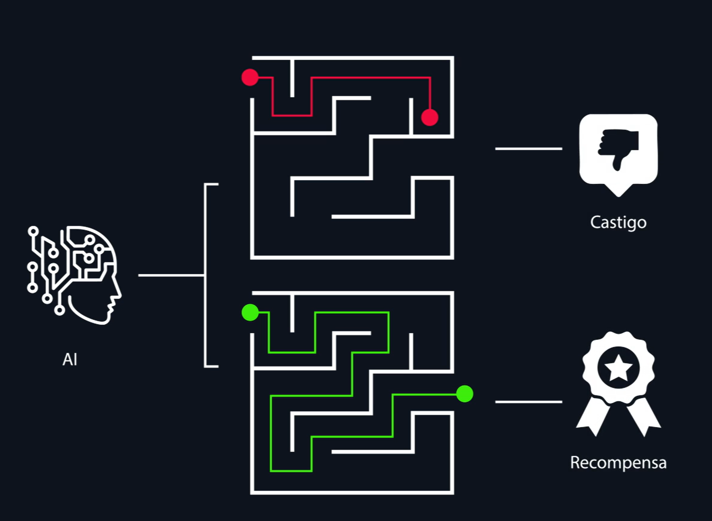

# Machine Learning (ML)

- El aprendizaje supervisado (entrenar con respuestas correctas).
- El aprendizaje no supervisado (descubrir patrones por sí misma).
- El aprendizaje por refuerzo (aprender mediante un sistema de recompensas).

# Q-learning
De los mas importantes en el aprendizaje por refuerzo.

Las maquinas toman la mejor desicion paso a paso, la IA calcula el valor Q que se refiere a la calidad de cada accion posible y elije la que promete el mejor resultado

# LLMs y arquitecturas generativas

Grandes modelos de lenguajes, entrenados con cantidades masivas de texto, estas predicen la siguiente palabra, solo predicen la palabra mas probable, esto puede dar origen a alucinaciones, el sesgo es cuando una IA aprende comportamientos inapropiados en base a escritos de humanos, como el racismo.

# Clasificacion
## Los modelos fundacionales (conocimientos generales).

De proposito general, no especializados en nada, buenos con todo(grande cantidad de datos).

## Los modelos ajustados (entrenados con datos específicos). 

tomar un modelo y entrenarlo con datos especificos(pequeñas cantidades datos ).

# GANs: generador vs. discriminador

Redes generativas antagonicas, 2 IA que compiten entre ellas para hacerse mejores
- El generador (que crea contenido).

- El discriminador (que juzga si es real o falso). 

# VAEs y espacio latente: intuición de compresión y reconstrucción

Autocodificadores variacionales

1. Codificador (Compresion),
tomar una imagen y comprimirla en espacios pequeños(Espacio latente)
2. Decodificador (Reconstructor), toma el espacio latente y reconstruye la imagen   

# Transformers: atención, contexto, escalabilidad, relevancia para agentes

atencion: permite leer el contexto, toma las palabras mas relevantes para establecerlo.
escalabilidad: la capacidad de recibir cantidades masivas de informacion

# Agentes AI: qué son, cómo funcionan y por qué son el siguiente paso

Entidad digital capaz de comprender un objetivo, analizar informacion y ejecutar acciones para alcanzarlo.

Componentes:
modelo de lenguaje
sistema de herramientas
memoria contextual

Son agentes entrenados con datos reales que pueden tomar decisiones y adaptarse a cada interaccion