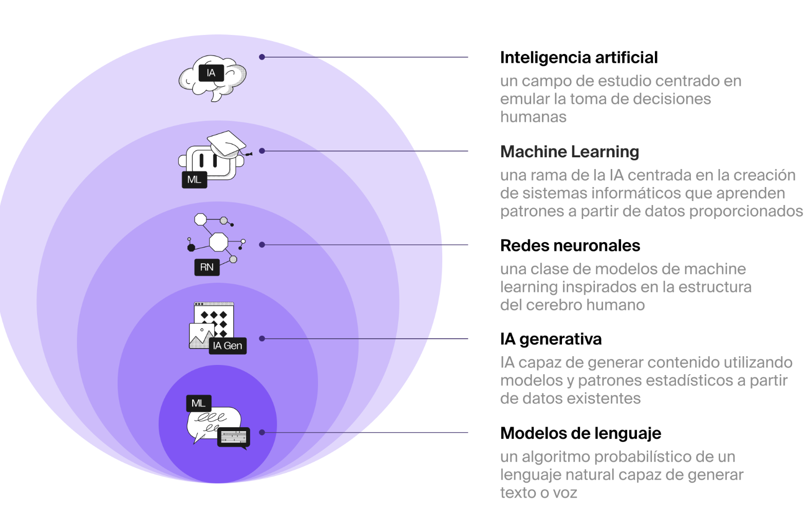
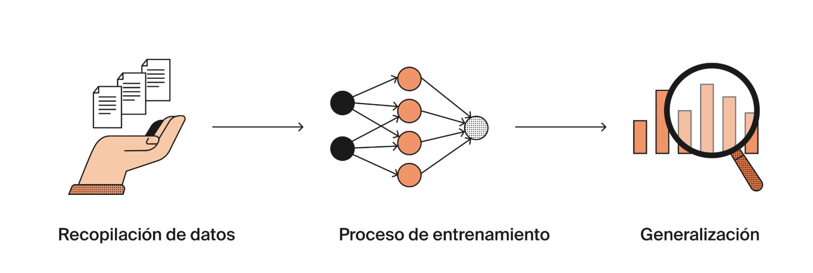
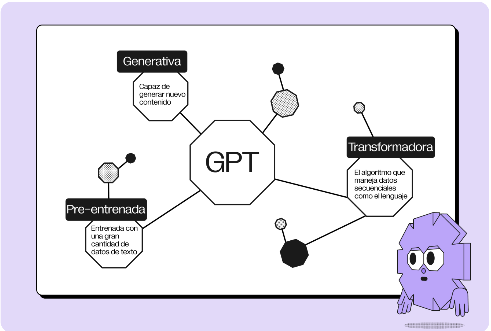

# Inteligencia artificial

La inteligencia artificial es un campo de estudio en las ciencias de la computación que desarrolla máquinas capaces de emular el razonamiento, aprendizaje y la toma de decisiones humanas.

# Machine learning

el programa no necesita recibir instrucciones directas en forma de código. En lugar de ello, aprende y se adapta basándose en los ejemplos que se le han dado y termina aprendiendo a predecir o clasificar cosas.

# Redes neuronales

son un método de machine learning. constan de componentes interconectados organizados en capas.

# IA generativa

utiliza redes neuronales para entender e imitar patrones, así como crear contenido nuevo con base en lo que ha aprendido a partir del contenido existente. Puede generar texto, imágenes, música y más.

# Modelos de lenguaje

Estos modelos se entrenan con cantidades masivas de datos de texto para entender y generar lenguaje humano. Aprenden cómo están estructuradas las palabras, cómo se combinan las oraciones entre sí y cómo se obtiene significado mediante las palabras.

# Cómo funcionan los modelos de IA

la capacidad de reconocer patrones es clave en los modelos de IA.

1. recolección de datos. Los modelos de IA necesitan datos para aprender
2. proceso de entrenamiento. Le damos nuestros datos al modelo, gradualmente aprende a predecir las respuestas correctas. El modelo puede cometer errores, pero al ajustar sus parámetros para mantenerlos al mínimo, puede mejorar con el tiempo.
3. la generalización, no solo los que aprendió a predecir, para convertirse en un modelo preciso que reconoce datos nuevos.
   

¿Cuál es el objetivo del paso de generalización de un modelo de IA?
Desempeñarse bien con datos nuevos y desconocidos

# ChatGPT

permiten a los usuarios que no cuentan con conocimientos técnicos especializados utilizar la IA generativa para varias tareas.
La tecnología detrás de ChatGPT es un modelo de lenguaje conocido como GPT. Representa un avance en el procesamiento de lenguaje natural, pues está entrenado con datos de Internet y puede realizar varias tareas.

ChatGPT es un chatbot construido sobre el modelo GPT.
es más adecuado para tareas básicas.
La mayoría de los modelos de lenguaje como ChatGPT tienden a alucinar o producir información falsa. Por este motivo, debes verificar cualquier información que recibas del modelo. Además, ChatGPT tiene acceso limitado a la navegación web, por lo que podría no proporcionar la información más actualizada.

# Gemini

Gemini es un modelo de IA multimodal que combina texto, imágenes, audio, video y código de programación. Se entrenó con una cantidad enorme de texto de Internet, libros, sitios web y otros recursos en varios idiomas.
las respuestas de Gemini suelen ser más concisas y menos creativas.
La principal diferencia entre ChatGPT y Gemini es la fuente de datos.
Gemini obtiene datos de Internet de forma continua, por lo que tiene acceso a la información más reciente, incluyendo fuentes científicas. Su capacidad para retener contexto (todo el texto previo en tu diálogo con el chatbot) puede variar dependiendo de la longitud y complejidad de las entradas anteriores.
Gemini es especialmente útil para llevar a cabo investigación y recolectar información actualizada de Internet.

# Caso de estudio: ChatGPT como desarrollador de software

Necesitarás un poco de conocimiento para entender qué escribir en tus prompts a ChatGPT para la creación de codigo.

# Las limitaciones de los modelos de lenguaje

- La calidad de las respuestas depende de los prompts que proporciones
- Alucinaciones: Un modelo de lenguaje puede generar información que no es exacta ni objetiva.
- Sesgo: una redacción descuidada o sesgada podría llevar a los modelos a generar resultados inapropiados o contenido basado en estereotipos
- Seguridad de los datos: Dado que algunos revisores humanos pueden llegar a tener acceso a tus conversaciones con el propósito de garantizar la calidad, debes evitar procesar con IA los datos confidenciales como nombres y otra información personal.
- Preguntas éticas: En algunos contextos, el uso de la IA puede causar problemas o, incluso, estar prohibido
