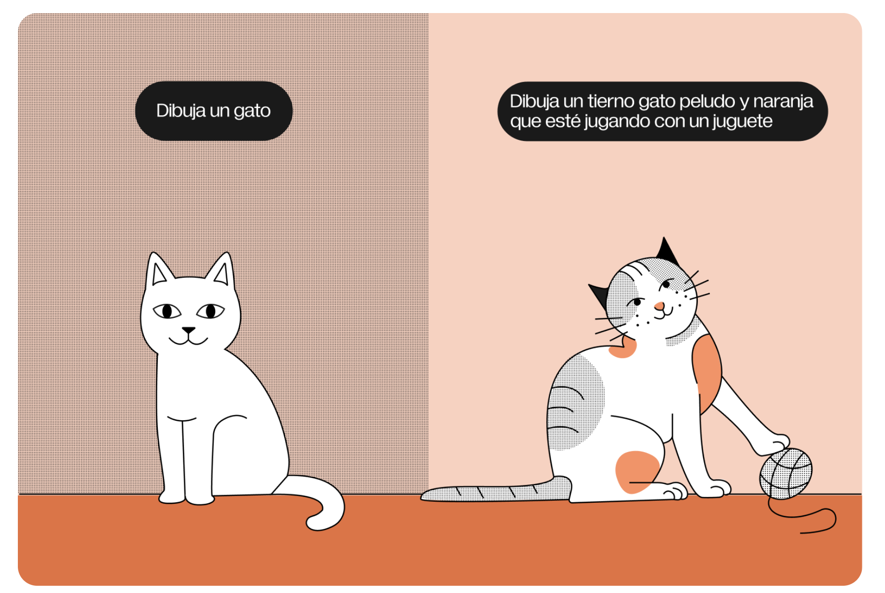
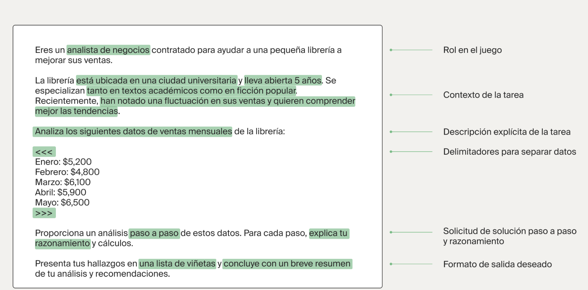

# Fundamentos de la ingeniería de instrucciones

## Prompts
Los prompts son instrucciones que se proporcionan a los modelos de IA generativa. El modelo considera cualquier cosa que ingreses en el chat como una instrucción.
Los prompts juegan un papel fundamental para determinar la estructura, tono y contexto del contenido generado por un modelo. Es poco probable que un prompt demasiado vago o que carece de contexto arroje el resultado deseado.

# Ingeniería de prompts
Requiere la comprensión de las capacidades y limitaciones del modelo, además de un enfoque creativo para escribir prompts.

Una opción es restringir la longitud del resultado si quieres una respuesta concisa.
los prompts impactan de forma significativa el resultado de la IA.

# Principios de escritura de prompts
Necesitamos prompts (instrucciones) bien estructurados para lograr que los modelos de lenguaje arrojen buenos resultados.

## Principio #1: Ser explícito
- Al trabajar con modelos de lenguaje, el primer (y más importante) principio es ser explícito. Una instrucción o guía precisa le dice al modelo cómo abordar la tarea. Evita la ambigüedad o las preguntas abiertas y enuncia claramente qué es lo que quieres que haga el modelo.
- Utiliza delimitadores para separar las partes del prompt: Por ejemplo, "", === o < >
- Proporciona ejemplos. Los modelos de lenguaje pueden aprender de un solo prompt con solo uno o pocos ejemplos. Este enfoque también se conoce como aprendizaje de pocos ejemplos (few-shot learning).

## Principio #2: Proporciona contexto
Esto ayuda al modelo de lenguaje a generar contenido dentro de un campo específico.
El contexto es cualquier información inicial que le proporcione al modelo antecedentes adicionales. 

## Principio #3: Juego de roles
Otra opción es comenzar tu conversación con frases como "Quiero que actúes como...". Esta pequeña expresión (o similares) le pide al modelo que asuma un puesto o rol, ofreciendo una forma práctica de simular escenarios e interacciones en el mundo real.

## Principio #4: Itera
Afinar tus instrucciones de forma repetida puede ayudar al modelo a comprender mejor tus intenciones. Si la respuesta inicial resulta inesperada, puedes iterar dando instrucciones o aclaraciones más específicas.

## Principio #5: Pide justificaciones
puedes evitar errores y lograr el resultado deseado más rápido.

# Componentes de un buen prompt

