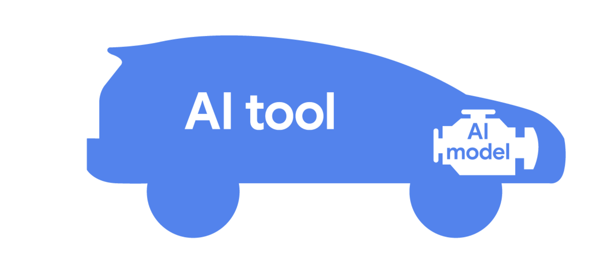

# Introducción al módulo 2
Las herramientas de IA revolucionaron nuestra forma de trabajar. ​Estas herramientas ofrecen soluciones creativas que ayudan a organizaciones y particulares ​a afrontar retos grandes y pequeños.

# Descubre aplicaciones de la IA generativa
la IA generativa es la IA ​capaz de generar contenido nuevo, como texto e imágenes entre otros.

# Entiende cómo funcionan las herramientas de IA
una herramienta de IA es un software basado en IA ​capaz de automatizar tareas o ayudar a los usuarios a realizarlas.

herramientas de IA independientes , ​como funciones de IA integradas o soluciones personalizadas.
Una herramienta de IA independiente es un software basado en IA que está diseñado para usarse solo. ​Las herramientas de IA independientes se pueden usar en línea ​o se pueden descargar a un dispositivo con poca o nula configuración técnica.
Una función de IA integrada alude a una mejora incorporada ​a un determinado software informático.
Las herramientas independientes y las funciones integradas son dos formatos habituales en que se usa la IA, ​pero las soluciones de IA personalizadas también son una opción. ​Una solución de IA personalizada es una aplicación ​hecha a medida para resolver un problema concreto, pero suelen requerir recursos dedicados ​y que la organización apoye su desarrollo.

Un modelo de IA es un programa informático entrenado con un conjunto de datos ​para reconocer patrones y realizar tareas específicas. ​Piensa en el modelo de IA como si fuera un motor ​y en la herramienta de IA como si fuera el auto. 

​El modelo proporciona la capacidad subyacente , ​mientras que la interfaz de la herramienta te ayuda a realizar las tareas. ​Ya sea que en el trabajo uses una herramienta independiente , ​una función integrada o una solución personalizada , ​recuerda que una herramienta de IA depende de un modelo de IA

1. Herramienta independiente (stand-alone AI tool): Es un software de inteligencia artificial que funciona por sí solo, sin necesidad de estar dentro de otro programa.

2. Función integrada (integrated AI feature): Es una función de IA que viene incorporada dentro de otro programa que ya usas.

3. Solución personalizada (custom AI solution): Es una herramienta de IA hecha a medida para resolver un problema específico.

# Modelos de IA y el proceso de entrenamiento
Las herramientas de IA y los modelos de IA son cosas distintas, aunque suenen parecidas y estén estrechamente relacionadas. Una herramienta de IA es un software potenciado por IA capaz de automatizar diversas tareas o ayudar a los usuarios a realizarlas. Un modelo de IA es un programa informático entrenado con conjuntos de datos para reconocer patrones y realizar tareas específicas. Todas las herramientas de IA se construyen sobre modelos de IA, que son necesarios para que las herramientas de IA funcionen.

Lo mismo ocurre con una herramienta de IA, que depende de un modelo de IA que sea su "motor", procese la información que le proporcionas como usuario y permita que la herramienta de IA funcione.

independientemente de la función específica de la herramienta de IA, se necesita un modelo de IA para que funcione.

Un agente de IA es una herramienta potenciada por IA que puede realizar tareas de forma autónoma con poca supervisión humana. Tú estableces las reglas de funcionamiento de los agentes de IA y los agentes de IA completan las tareas siguiendo esas reglas, permitiéndote trabajar en otras.

Algunas herramientas de IA incorporan múltiples modelos de IA, que trabajan juntos para lograr más resultados y realizar una gama más amplia de tareas. Cada modelo de la herramienta puede especializarse en una subtarea específica, contribuyendo así a la funcionalidad global de la herramienta de IA. 

# El proceso de entrenar modelos de IA
Los diseñadores de IA desarrollan modelos de IA mediante un proceso llamado entrenamiento.

1. Definir el problema que se quiere resolver. Consideran las características y limitaciones de la herramienta de IA antes de identificar una solución de IA.
2. Recopilar los datos pertinentes para entrenar al modelo. 
3. Preparar los datos para el entrenamiento. Los diseñadores de IA preparan los datos mediante el etiquetado de las características importantes. También es habitual separar los datos en dos conjuntos distintos: un conjunto de entrenamiento para utilizar durante la fase de entrenamiento y un conjunto de validación para hacer la prueba una vez finalizado el entrenamiento.
4. Entrenar al modelo. aplican programas de aprendizaje automático (ML) a los datos de entrenamiento preparados.
5. Evaluar el modelo. utilizan el conjunto de validación que prepararon antes para evaluar la capacidad que tiene su modelo de pronosticar las precipitaciones con precisión y fiabilidad. El análisis del rendimiento de un modelo puede revelar posibles problemas que lo afecten, como datos de entrenamiento insuficientes o sesgados. 
6. Implementar el modelo. 

El entrenamiento de los modelos es un proceso iterativo. Los ingenieros y diseñadores de IA pueden repetir cada paso todas las veces que haga falta y hacer ajustes hasta crear el mejor modelo posible. 
Los diseñadores de IA deben hacer un seguimiento constante de sus modelos y recabar comentarios sobre ellos para garantizar que sigan funcionando de manera confiable e identificar áreas que deban mejorarse.

Para que una IA pueda hablar, se necesitan modelos de inteligencia artificial que entiendan y generen lenguaje humano. Estos modelos se llaman modelos de lenguaje. Piensa en ellos como un traductor muy inteligente que aprende a partir de muchos ejemplos de conversaciones, textos y palabras para saber cómo responder y comunicarse de forma natural. Estos modelos reconocen patrones en el lenguaje y pueden crear frases que tengan sentido, como si estuvieras hablando con una persona.

