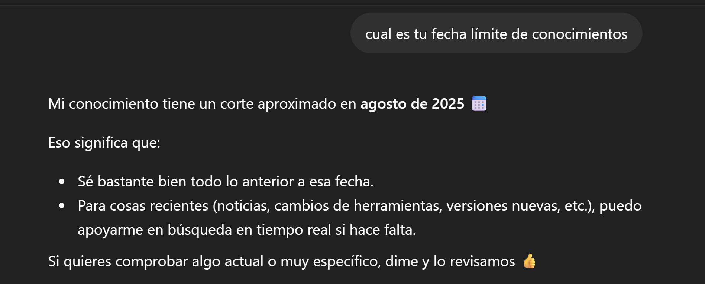

# Riesgos de seguridad y privacidad de la IA
La privacidad es el derecho de un usuario a tener el control sobre la forma en que su información personal y ​datos ​se recopilan, almacenan y utilizan.

​La seguridad es el acto de salvaguardar la información personal ​y los datos privados , ​y garantizar la seguridad del sistema ​impidiendo el acceso no autorizado. 

antes de utilizar una herramienta de IA, conoce sus condiciones de uso o servicio , ​política de privacidad y cualquier riesgo asociado. ​
Antes de aceptar las condiciones de servicio de un sitio web o una aplicación , ​sé consciente de qué datos se recopilan ​y cómo podrían utilizarse. 

no introduzcas información personal o confidencial.
​mantén en privado la información, como tu identidad , ​los datos presupuestarios de tu departamento o la dirección de correo electrónico. ​

evita introducir información confidencial ​en una herramienta de IA ​para evitar que los datos estén disponibles para terceros ​durante una violación de seguridad o fuga de datos. ​

# Sesgo, desvío y límite de conocimientos

##  Qué es el sesgo de datos
Se produce cuando los datos utilizados para entrenar un modelo de IA están sesgados, son incompletos o reflejan prejuicios históricos o sociales. Dado que los resultados que arroja la herramienta son un reflejo directo de los datos de entrenamiento, la IA puede aprender y hasta ampliar estos sesgos en sus respuestas.

## La restricción del límite de conocimientos
un modelo de IA se entrena en un momento determinado. Los modelos de IA tienen un límite de conocimientos porque sus conocimientos básicos se basan en los datos con los que fueron entrenados.

Los conocimientos básicos del modelo no se actualizan, por lo que el concepto de límite de conocimientos sigue siendo una restricción crítica que hay que tener en cuenta.

El uso responsable de la IA requiere que verifiques la información urgente. Utiliza siempre un motor de búsqueda u otras fuentes fiables para contrastar estadísticas, noticias o cualquier información sobre acontecimientos recientes.

## Desvío en los resultados de una herramienta de IA

El desvío es la reducción gradual de la exactitud y relevancia que ofrece una herramienta de IA a medida que el mundo real cambia. 

- Desvío de los hechos: Esto ocurre cuando la IA pierde precisión a lo largo del tiempo debido a su límite de conocimientos.

- Desvío del comportamiento: Se refiere a los cambios en el comportamiento de una herramienta de IA a lo largo del tiempo. A medida que los desarrolladores actualizan los modelos, es posible que notes que el formato, el tono o el estilo de conversación de la herramienta cambian, incluso aunque utilices las mismas instrucciones.

# Shaun: Desarrolla una IA que le sirva a todo el mundo
Una forma de abordar el sesgo ​y el contenido dañino es asegurarnos ​de que nuestros conjuntos de datos sean apropiados ​y representativos de una amplia variedad de personas. ​

# Cómo usar la IA de forma responsable
Utilizar la IA de forma responsable significa tener una actitud intencionada y reflexiva en relación con las instrucciones que brindas, para garantizar la calidad, seguridad y exactitud de los resultados. 

1. Escribe instrucciones que sean claras y específicas
2. Protege la información sensible ¿Estoy agregando en mi instrucción datos privados de alguna persona?
3. Proporciona información de alta calidad
4. Siempre verifica los resultados

